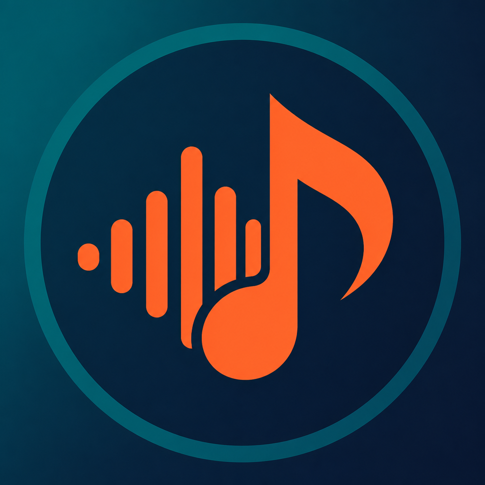

# Rihan Music Bot

**Repository:** https://github.com/im-rihan/RihanMusicBot

<p align="center">
  
</p>

A production-ready Discord music bot built with **discord.js v14**, **@discordjs/voice**, and **yt-dlp** streaming.

## Features

- Play from YouTube, Spotify links, SoundCloud, or search by name
- Queue, loop (track/queue), shuffle, volume, jump, remove, clear
- Now Playing embeds with Pause / Resume / Skip / Loop / Stop buttons
- 24/7 mode, DJ role, voice channel lock
- Bass boost & equalizer presets
- Autoplay related songs
- Play history (JSON file store)
- Docker support

## Requirements

- Node.js **22.12+** (required by `@discordjs/voice` + DAVE)
- A Discord bot application ([Developer Portal](https://discord.com/developers/applications))
- FFmpeg (bundled via `ffmpeg-static`)
- yt-dlp (bundled via `youtube-dl-exec`)

## Setup

### 1. Create the Discord application

1. Open the [Discord Developer Portal](https://discord.com/developers/applications)
2. **New Application** → name it (e.g. Rihan Music)
3. **Bot** → **Add Bot**
4. Enable **Message Content Intent** (and optionally Server Members / Presence)
5. Copy the **bot token**
6. **OAuth2 → URL Generator**: select `bot` + `applications.commands`
7. Permissions: View Channels, Send Messages, Embed Links, Read Message History, Connect, Speak, Use Voice Activity
8. Invite the bot with the generated URL

### 2. Configure the project

```bash
cd RihanMusicBot
cp .env.example .env
```

Edit `.env`:

```env
DISCORD_TOKEN=your_bot_token
CLIENT_ID=your_application_client_id
GUILD_ID=your_test_server_id
OWNER_ID=your_discord_user_id
```

Set `GUILD_ID` while developing so slash commands appear instantly. Leave it empty for global deploy.

### 3. Install & deploy commands

```bash
npm install
npm run deploy
npm start
```

## Commands

| Command | Description |
|---------|-------------|
| `/play` | Play a song or playlist |
| `/pause` `/resume` | Pause / resume |
| `/skip` `/stop` | Skip / stop & clear |
| `/queue` `/nowplaying` | Queue & now playing |
| `/loop` `/shuffle` `/volume` | Loop, shuffle, volume |
| `/clear` `/remove` `/jump` | Manage the queue |
| `/disconnect` | Leave voice |
| `/search` `/lyrics` | Search & lyrics links |
| `/autoplay` `/filter` `/history` | Extra playback tools |
| `/247` `/dj` `/lock` `/unlock` | Admin controls |
| `/setup` `/restart` | Config & owner restart |
| `/help` | Command list |

## Docker

```bash
cp .env.example .env
# fill in .env
docker compose up -d --build
```

Slash commands still need a one-time deploy from a machine with Node:

```bash
npm install
npm run deploy
```

## Project structure

```
RihanMusicBot/
├── src/
│   ├── commands/          # Slash commands
│   ├── events/            # Discord events
│   ├── player/            # Queue, stream, filters, resolver
│   ├── buttons/           # Now Playing button handlers
│   ├── database/          # Guild settings & play history
│   ├── utils/             # Embeds, permissions, loader, logger
│   ├── config.js
│   └── index.js
├── deploy-commands.js
├── Dockerfile
├── docker-compose.yml
├── .env.example
└── package.json
```

## Notes

- Storage uses a local JSON file (`data/bot.json`) for guild settings and play history — no native DB build required.
- Spotify links are resolved by searching the matching track on YouTube (Discord bots cannot stream Spotify audio directly).
- YouTube availability can change; if streams fail, update `play-dl` or consider a yt-dlp-based extractor later.
- Keep your bot token secret. Never commit `.env`.

## License

MIT
